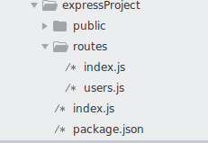
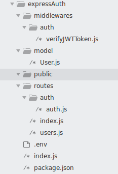

# nodejsExpressScafolding (Express App generator)
A custom express generator node script with minimum dependencies and modern JS (no vars only lets and consts and ES6)

I made this because the current version of express generator (which i have in my system) uses var very much and old ES5 syntax.
But I usually use ES6 and above syntax which makes my project look very inconsistent. So i made this to solve my problem :) and I hope this will be helpful to you too.

It also has some error handling middlewares (for catching 404s and all errors global handler)

There are 2 scripts(currently) each described below.

## Script 1: simple Express application scafolding

### Create a new express app
`node simpleExpressTemplateWithRoutes.js < your-project-name >`
### U can also get usage info if u simply run the script without passing any arguments
` node simpleExpressTemplateWithRoutes.js `

### Example: Lets create a new express project called expressProject
```javascript
node simpleExpressTemplateWithRoutes.js expressProject
cd expressProject
npm install
npm start   (OR   node index.js) 
```
npm start command will start express server in port 3000. Visit <http://localhost:3000>
>npm start will use nodemon so install nodemon if u don't have it already by
`npm install -g nodemon`
nodemon will watch for any code change during your development and restart the server whenever the file change is saved.

### Project Folder Structure created by this script


>| NOTE | : In package.json the dependencies express and morgan is set to latest so u can keep it as is or set it to version of your choice.
Also the project descriptions fields are empty which u can fill.

## Script 2: Express + MongoDb with Authentication using JWT(json web token) scafolding ...
### Usage similar to previous
`node simpleExpressTemplateWithAuthJWT.js expressAuth`

### Project Folder Structure created by the script


>New packages are added here which includes (bcryptjs, jsonwebtoken, dotenv)
### How authentication works in this project
1. Simple Users Schema(name, email, password, timestamps) in /model/User.js
2. "/auth/register" route for registering new users 
3. "/auth/login" route for login procedure .. if success it returns {status:true , token: "JWT token"}
4. Now all the routes which are protected(requires user to be logged in ) requires a Valid JWT token in their header with name auth-token i.e `auth-token: "JWT token that you got after successful login"`
5. A middleware for verifying JWT token named 'verifyJWTToken.js' is there in '/middlewares/auth/verifyJWTToken.js'
6. For protecting any route with authentication simply import verifyJWTToken.js and add it before sending sensitive datas. Example of this is present in users.js where '/' route is protected with this middleware.

## About the script | Detailed explanation

>The scripts are very easy to follow. If any one is willing to contribute. I am open for pull request :)

Its a node script which uses file system (fs) module to create files and directories.
To make this script I first:
1. Promisified the fs module inside a helper function like this
```javascript
const createDirectory = (dirname) => {
  return new Promise( (resolve, reject) => {
    if(folder exists) reject("directory already exists");
    fs.mkdir(dirname, err => {
      if(err) reject(err);
      else resolve("Directory:"+dirname+"successfully created");
    });
  });
}
```
Similar function createFile is created for file creation. Look into the code for more details (above is just a rough example). Also i was too lazy to refactor this to use template string instead :_

2. Ok.. now i can use createDirectory('mydir').then().then()..... but i have to create multiple directories so i thought it would be easy(and more readable) if i just used async/await.
But to use await we need whole code to be inside an async function .. Hm .. o yeah lets make an anonymous function and also invoke it without assigning it into new varible and calling it i.e like this `()();`. An anonymous function is a function without a name and its dynamically created at  runtime.
Lets create and invoke it as well like this:
```javascript
( async() => {
  
  //all my codes... yes i am too lazy to write.
  
  try {
  
    console.log(await createDirectory(PROJECT_NAME)); //since the promise when resolved/rejected will return string lets also print it in console
  
  } catch(err){
    console.log("ALL REJECTED PROMISE MESSEGES"+err);
  }
  
})();

```

3. Yes, the rest is pretty easy. every file is just a variable with a template string. For example
```javascript
indexFile = `
const express = require("express");
const app = express();
..
..
..
app.listen(3000,() => {console.log("Server listening at port 3000")});
`
//writing indexFile in index.js file
createFile(PROJECT_NAME + "/index.js", indexFile);
//Similar for other files
```

4. One more thing (though not very important here) I used process.argv for getting the project name from the arguments passed in the command
For the command `node my-script.js myargument1 myargument2` the process.argv array will have ['node', '/home/asdf/my-script.js', myargument1, myargument2]
So to get the first argument we have to use process.argv[2] which is done in the script

> So U can use this to make your own custom express generators. :) If u do please consider sharing it with the community.
> Any improvements or pull requests are welcome :).. 